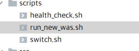

# 짭팡 (jjab_pang)

---

# JjabPang

쿠팡 클론 프로젝트

※ 백엔드 + 프론트 엔드 협업 프로젝트

# 목차

- [짭팡 (jjab_pang)](#----jjab-pang-)
- [JjabPang](#jjabpang)
    * [개발 환경](#-----)
        + [백엔드 (박상준)](#---------)
        + [프론트엔드 (김신협, 이주상)](#----------------)
    * [사용 기술](#-----)
        + [백엔드](#---)
            - [주요 프레임워크 / 라이브러리](#----------------)
            - [Build tool](#build-tool)
            - [Database](#database)
            - [Infra](#infra)
        + [프론트엔드](#-----)
        + [기타 주요 라이브러리](#-----------)
    * [핵심 키워드](#------)
    * [시스템 아키텍쳐](#--------)
    * [WAS 아키텍처](#was-----)
    * [E-R 다이어그램](#e-r------)
    * [프로젝트 목적](#-------)
        + [쿠팡 클론 프로젝트를 기획한 이유?](#-------------------)
    * [핵심 기능(릴리즈 후 추가 개선)](#------------------)
    * [핵심 기능(릴리즈 전)](#------------)
        + [ModelMapper 사용으로 코드 간략화](#modelmapper------------)
        + [QueryDsl To JPQL](#querydsl-to-jpql)
        + [github 액션 + AWS CODE DEPLOY + AWS EC2](#github------aws-code-deploy---aws-ec2)
            - [이미지와 썸네일 삽입시는 ~~깃허브~~ aws s3 이미지 서버로](#----------------------aws-s3--------)
        + [스웨거 사용](#------)
        + [기본적인 게시물 CRUD](#---------crud)
        + [카테고리 깊이 구현 및 추후 깊이관련 기능 추가예정](#----------------------------)
        + [에러처리](#----)
        + [Qdsl 동적 정렬 및 동적 조건](#qdsl--------------)
        + [CI/CD 무중단 배포](#ci-cd-------)
    * [프로젝트를 통해 느낀점](#------------)
    * [프로젝트 관련 추가 포스팅](#--------------)

## 개발 환경

### 백엔드 (박상준)

- IntelliJ
- Postman
- Intellij .http
- GitHub
- Intellij Git
- DataGrip
-

### 프론트엔드 (김신협, 이주상)

## 사용 기술

### 백엔드

#### 주요 프레임워크 / 라이브러리

- Java 11 openjdk
- SpringBoot 2.2.2
- SpringBoot Security
- Spring Data JPA
- Json Web Token
- Qdsl

#### Build tool

- Gradle

#### Database

- Mysql

#### Infra

- AWS EC2
- AWS S3
- Github Actions
- AWS CodeDeploy
- AWS RDS

### 프론트엔드

- HTML / CSS
- REACT
- REDUX

### 기타 주요 라이브러리

- Lombok
- ModelMapper
- p6spy

## 핵심 키워드

- 스프링 부트, 스프링 시큐리티를 사용하여 웹 애플리케이션 생애 주기 기획부터 배포 유지 보수까지 전과정 개발과 운영 경험 확보
- AWS / 리눅스 기반 CI/CD 무중단 배포 인프라 구축
- JPA, Hibernate를 사용한 도메인 설계
- MVC 프레임워크 기반 백엔드 서버 구축

## 시스템 아키텍쳐

https://img1.daumcdn.net/thumb/R1280x0/?scode=mtistory2&fname=https%3A%2F%2Fblog.kakaocdn.net%2Fdn%2FnBCGB%2FbtrFzNmbwAR%2FroFSU19mpzgDfwNktBaBEK%2Fimg.png

## WAS 아키텍처

## E-R 다이어그램

## 프로젝트 목적

### 쿠팡 클론 프로젝트를 기획한 이유?

처음에는 프로젝트는 기존 사이트의 불편한 점을 개선해야한다는 생각과 클론사이트는 의미가 없지 않느냐 라는 생각을 가지고 있었습니다

하지만 기존 사이트야 말로 실제로 개발자들이 수년간 유지보수및 개발을 진행하면서 수 많은 시행착오를 거친 그 부산물이라고 생각되어 쿠팡 사이트의 일부분을 클론하게 되었습니다.

현재 2022.08.14 일 기준으로는 어드민 사이트를 별도로 구현하지는 못하였습니다. 하지만 시큐리티의 정수인 어드민과 일반 유저가의 접속 권한에 따른 분기를 설정하기 위하여 앞으로 구현할 생각이 있습니다.

---

## 핵심 기능(릴리즈 후 추가 개선)

---

## 핵심 기능(릴리즈 전)

### ModelMapper 사용으로 코드 간략화

기존에는 리플렉션을 통해 객체 매핑을 해주는 `ModelMapper` 를 사용

### QueryDsl To JPQL

QueryDsl로 모든 쿼리를 작성할 이유가 없어짐 되려 어디에서 어디를 참고하고 있는지 그 파일의 위치만 분산되는거 같아 기존 QueryDsl 을 JPQL로 변경함.. 동적으로 쿼리를 만들어야하는 경우는 QDsl를
사용해야하지만, 그렇지 않은 경우는 `QueryMethod` 나 `JPQL`을 사용하는 것이 좋다고 생각됨,

### github 액션 + AWS CODE DEPLOY + AWS EC2

배포 자동화를 사용하여 개발자가 코드를 푸쉬 혹은 `PR` 을 신청할 때마다 EC2 서버에 반영되도록 하였습니다.

#### 이미지와 썸네일 삽입시는 ~~깃허브~~ aws s3 이미지 서버로

### 스웨거 사용

프론트엔드 개발자나 다른 개발자들에게 문서화된 REST API 를 전달하기 위해 스웨거 적용

스웨거 url 접속을 편하게 하기 위하여

스웨거 리다이렉터 컨트롤러 작성

### 기본적인 게시물 CRUD

게시물에 대한 기본적인 CRUD를 모두 구현하였습니다.

### 카테고리 깊이 구현 및 추후 깊이관련 기능 추가예정

카테고리의 깊이를 구현하였습니다.

컬럼에 별도의 부모No 를 추가하여 해당 컬럼의 부모 컬럼을 지정하였습니다.

DB에서 조회시에는 오라클에서는 start with connect by 구문을 활용하여 쉽게 상위 부모에 대한 하위 깊이 데이터를 불러올 수 있지만,
MYSQL에서는 8버전 이상인 경우에만 재귀함수로 해당 기능을 구현가능합니다. 하지만 5버전의 경우 해당 기능을 구현은 가능하지만 상대적으로 불편한 것으로 알고 있습니다.

그래서 향후, 8버전으로 올리려고 합니다.

### 에러처리

에러 처리의 경우 자바의 Optional 을 사용, orelsethrow > customError 혹은 자바 자체의 illegalStateException 등을 활용하여 api로 에러 코드를 전달할 수 있도록
하였습니다.

또한 ResponseEnitity로 message와 header status를 전달하는 방식을 채용했습니다.

### Qdsl 동적 정렬 및 동적 조건

OrderSpecifier 를 반환값으로 하여 boardSort 기능 구현하였습니다
boardSort의 경우 api requestBody안에 sort & orderBy Key 값에 해당하는 Value 를 전달하게 된다면 해당하는 엔티티의 컬럼값에 맞춰 정렬이 가능합니다.

복잡한 쿼리를 여러개 만들어내는 수고를 덜 수 있다는 장점이 있습니다.

### CI/CD 무중단 배포

애플리케이션 출시에 있어서 지속적 통합과 지속적 배포를 위해 깃헙 , AWS CodeDeploy를 사용했으며 빌드와 배포를 분리하기 위해 github Action과 AWS s3를 이용했습니다.

깃헙으로 push된 프로젝트는 action 에서 설정에 따라 자동화 테스트를 거쳐 빌드되며 빌드된 jar는 AWS S3에 저장됩니다.

이후 배포요청을 받은 CodeDeploy는 S3에서 jar 파일을 넘겨받아 ec2로 파일을 넘겨주며 이때 배포 수명 주기의 순서대로 설정된 스크립트를 실행하게 됩니다.

여기서 무중단 배포를 구현하기 위하여 EC2의 8070과 8071 포트에 프로젝트 jar 두개를 구동시키고 엔진엑스로 8080포트를 열되

엔진엑스는 70과 71중 하나의 포트만 리버스 프록시하도록 했습니다.

이때 바라보지 않는 포트의 앱이 새로 배포되는 대상이 됩니다.

scripts // health_check.sh ... 등의 스크립트를 통하여 해당 포트가 지금 올라가있는지 여부를 확인 후

해당 포트가 올라가있다면 여분의 포트에 업데이트한 jar 파일을 배포한다.

8070 포트에 업로드 하였다면 8071이 운영중인 상태고 배포시 8070 포트가 운영중인 상태로 변경된다.
그렇게 무중단 CI/CD 가 가능한 것이다.

## 프로젝트를 통해 느낀점

JPA가 상당히 편하다고 생각했지만, 역시 인간은 평소에 사용하던 기술만 사용하고 이게 편안하다는 인식을 가지게 될 수 밖에 없는건가.. mybatis가 더 편할 거같은데? 라는 생각이 중반까지는 들었다.

데이터 모델링 및 코드 짜는 부분은 생각보다 오래걸리지 않았다. 하지만 배포하는 부분과 보안관련 부분이 나에게 너무 큰 벽처럼 느껴졌다. aws도 별도의 자격증을 따는 데, 처음에는 이걸 왜 자격증까지? 라고
생각했지만..

실제로 aws 를 만지면서.. 와 이건 엑셀 파워포인트 이런 친구보다 훨씬 복잡하고 민감한 친구라고 느꼈다. 평소에 공부를 해야겠다고 생각했다.. ci/cd 는 진짜 4일 5일 내내 고생했다. 배포했는데 안돼~
yml 파일 수정했는데 안돼 ~ 잘되던 github action이 문제야 이번엔 code deploy가 문제야~

답답해서 죽어버릴것 같았다.

JPA도 union이 안될줄은 상상도 못했다.  
코드짜는 것은 컴파일 과정에서 에러를 잡아주니까 상당히 편했다. 에러 체크도 편하고..
하지만 별도의 가상 테이블로 연결하는 방식은 별도의 코드로 구현해서 사용해야한다고 하는데 이건 조금 불편하지 않나.. 향후 무조건적으로 지원해줘야한다고 생각한다.

## 프로젝트 관련 추가 포스팅

